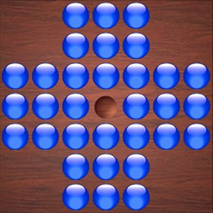

## About:

Game of marble solitaire is also known as peg of solitaire. In this game we have board with 33 holes. Initially all holes are filled with marbles except the center hole.
Moves: We can pick only a marble that is 2 unit distance away from an empty hole (horizontally or vertically) and there must be a marble hole b/w this marble and the empty hole. We put this marble in the hole and remove marble (from the board) b/w the marble picked for action and the empty hole.
 
 

- My C++ implementaion is taking idefinite time to solve the puzzle but python implementation is working like a charm.
- UCS stands for Uniform Cost Search

To understand my work fully refer my medium article: https://medium.com/@warriorak77/peg-of-solitaire-game-busted-with-ai-c5f73466f8c3

## Caution
© Anyone must take permission form me and mention my social handles in 
the references/attributes before using this code in their work or project.  
Linkedin: https://www.linkedin.com/in/akshay-189a48200/  
Twitter: https://twitter.com/notifications  
Medium: https://medium.com/@warriorak77  
GitHub: https://github.com/webintellectual  
Website: https://akshaysworklife.bio.link/